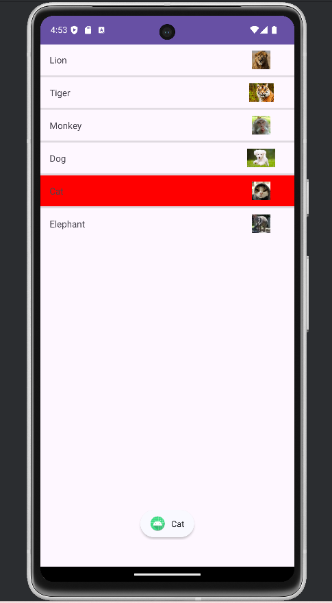
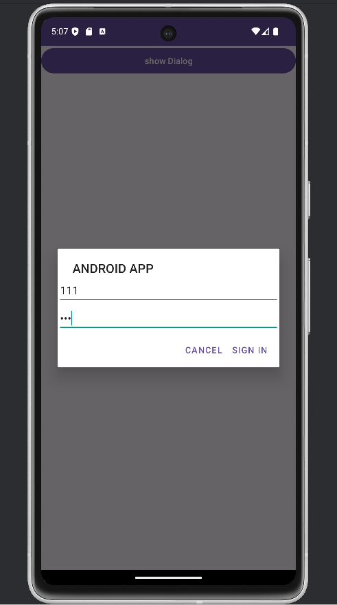
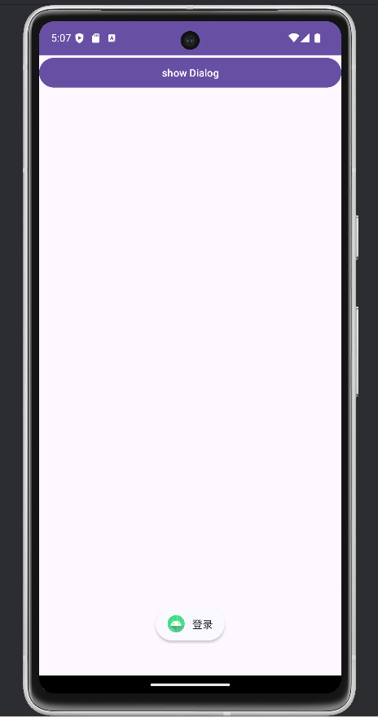
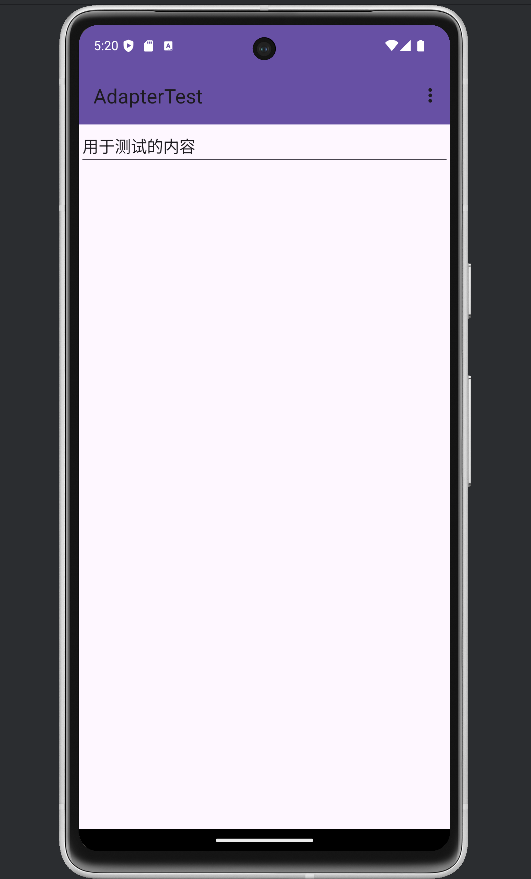
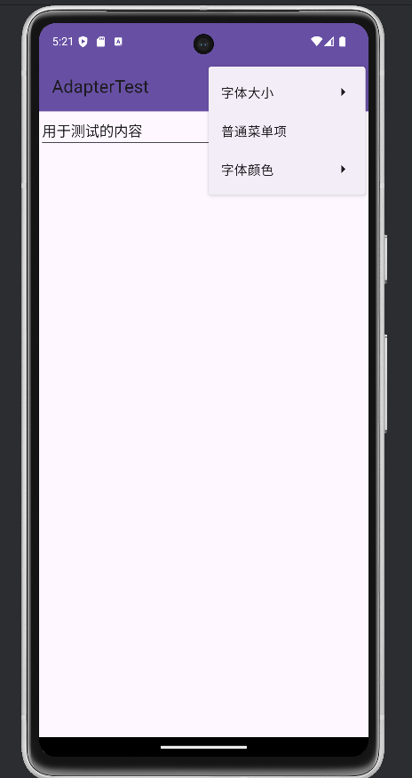
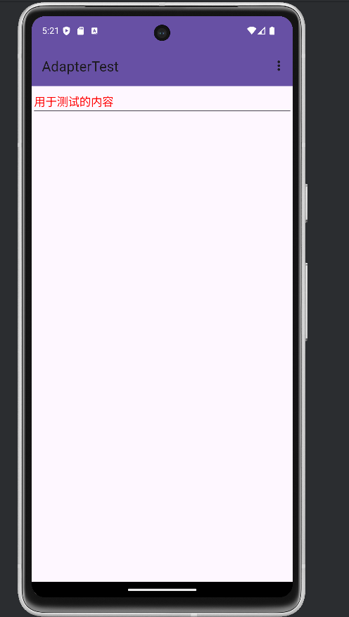
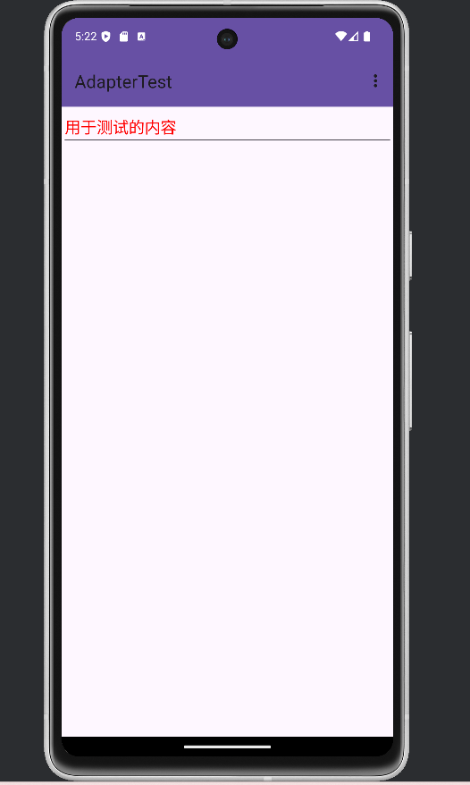
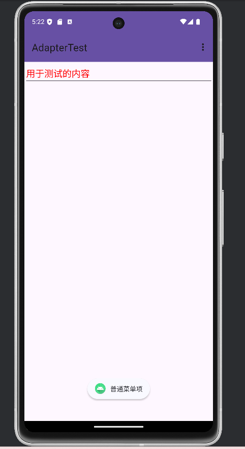
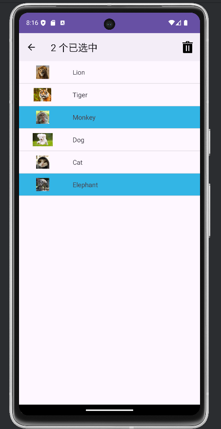
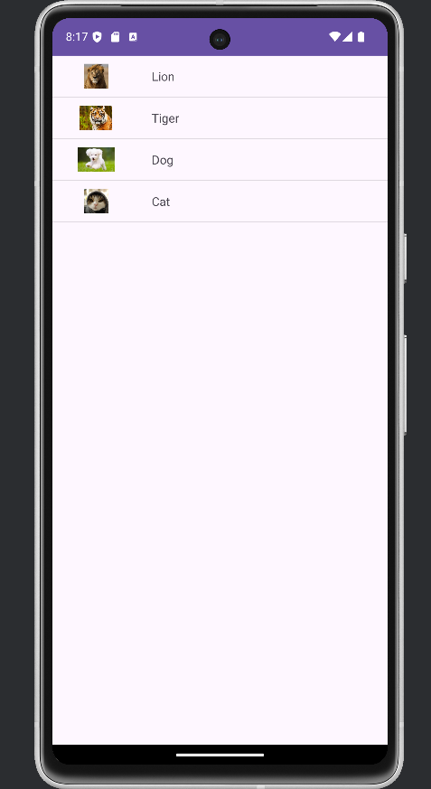

# Android界面组件实验
包含以下实验：
* Android ListView的用法
* 创建自定义布局的AlertDialog
* 使用XML定义菜单
* 创建上下文操作模式(ActionMode)的上下文菜单
## 一 Android ListView的用法
ListView需要设置一个list item的布局，通过Adapter进行装配。
### 1、创建一个SimpleAdapterTest的Activity，同时创建一个activity_simple_adapter_test.xml布局文件，以及simple_item.xml布局文件
### 2、将activity_simple_adapter_test.xml绑定到SimpleAdapterTest
```
setContentView(R.layout.activity_simple_adapter_test);
```
### 3、编写activity_simple_adapter_test.xml
对于activity_simple_adapter_test.xml中只需要包含一个ListView，并设置id `android:id="@+id/mylist"` 以供获取该组件。同时设置`android:listSelector="@color/red"`以实现选中列表项时，更改背景颜色。设置`android:dividerHeight="3dp"`，设置列表项之间的分隔线。
```
<ListView
        android:id="@+id/mylist"
        android:layout_width="match_parent"
        android:layout_height="wrap_content"
        android:listSelector="@color/red"
        android:dividerHeight="3dp"/>
```
### 4、编写simple_item.xml
simple_item.xml是列表项单项的布局，对实验要求分析，可以采用表格布局，对第一列的TextView进行拉伸
```
android:stretchColumns="0"
```
然后图片采用ImageView作为第二列。
```
    <TableRow>

        <TextView
            android:id="@+id/name"
            android:layout_width="wrap_content"
            android:layout_height="50dp"
            android:textSize="15sp"
            android:padding="15dp" />

        <ImageView
            android:id="@+id/header"
            android:layout_width="107dp"
            android:layout_height="50dp"
            android:minHeight="30dp"
            android:padding="10dp"/>

    </TableRow>
```
### 5、使用SimpleAdapter进行装配
在SimpleAdapterTest，定义names数组和images数组，依次定义，这里要注意一一对应。
```
private String[] names = new String[]{"Lion", "Tiger", "Monkey", "Dog", "Cat", "Elephant"};
private int[] images = new int[]{R.drawable.lion, R.drawable.tiger, R.drawable.monkey, R.drawable.dog, R.drawable.cat, R.drawable.elephant};
```
然后在onCreate方法中，将它们放入一个map的list的数据集里面，每个map都存储String与Object的对应关系，String中是之后定义Adapter所用的，作为from的参数。
```
        List<Map<String, Object>> listItems = new ArrayList<>();
        for(int i = 0; i < names.length; i++){
            Map<String, Object> listItem = new HashMap<>();
            listItem.put("name", names[i]);
            listItem.put("header", images[i]);
            listItems.add(listItem);
        }
```
然后定义一个SimpleAdapter，第一个参数是context，是当前的上下文，这里采用this表示当前Activity；第二个是list集合数据集；第三个是列表项的布局；第四个是之前所编写的map对应的String集合；第五个是第四个String集合所对应要填充的列表项布局的组件。
```
SimpleAdapter simpleAdapter = new SimpleAdapter(this, listItems, R.layout.simple_item,
    new String[]{"name", "header"}, new int[]{R.id.name, R.id.header});
```
将SimpleAdapter装配到ListView上
```
ListView list = findViewById(R.id.mylist);
list.setAdapter(simpleAdapter);
```
为ListView添加一个点击弹出Toast的提示
```
list.setOnItemClickListener((parent, view, position, id)->{
    Toast.makeText(this, names[position], Toast.LENGTH_SHORT).show();
});
```

### 结果


## 二 创建自定义布局的AlertDialog
### 1、创建一个AlertTest的Activity，同时创建一个activity_alert_test.xml布局文件
### 2、将activity_alert_test.xml绑定到AlertTest
```
setContentView(R.layout.activity_alert_test);
```
### 3、编写activity_alert_test.xml
这个activity中只有一个按钮，并将这个按钮在AlertTest中获取并定义一个监听器，实现showAlert方法
```
    <Button
        android:id="@+id/sd"
        android:layout_width="match_parent"
        android:layout_height="wrap_content"
        android:text="show Dialog" />
```
```
    Button sd = (Button)findViewById(R.id.sd);
        sd.setOnClickListener((view -> {
            showAlert();
        }));
```
### 4、编写showAlert方法
要实现弹出一个提醒对话框，调用AlertDialog.Builder 对象，
```
AlertDialog.Builder builder = new AlertDialog.Builder(AlertTest.this)
```
然后对其`.setTitle("ANDROID APP")`设置tittle，`.setView(R.layout.alert_content_view)`设置一个内部的布局
内部包含2个输入框，提示UserName和Password输入。密码设置inputType为密码输入。
```
<LinearLayout xmlns:android="http://schemas.android.com/apk/res/android"
    android:layout_width="match_parent"
    android:layout_height="match_parent"
    android:orientation="vertical">
    <EditText
        android:id="@+id/userName"
        android:layout_width="match_parent"
        android:layout_height="wrap_content"
        android:hint="UserName"/>
    <EditText
        android:id="@+id/password"
        android:layout_width="match_parent"
        android:layout_height="wrap_content"
        android:inputType="textPassword"
        android:hint="Password"/>
</LinearLayout>
```
然后为其设置2个按钮，一个为登录，一个为取消，分别弹出Toast提醒
```
.setPositiveButton("Sign in", new DialogInterface.OnClickListener() {
                    @Override
                    public void onClick(DialogInterface dialogInterface, int i) {
                        Toast.makeText(AlertTest.this, "登录", Toast.LENGTH_SHORT).show();
                    }
                })
                .setNegativeButton("Cancel", new DialogInterface.OnClickListener() {
                    @Override
                    public void onClick(DialogInterface dialogInterface, int i) {
                        Toast.makeText(AlertTest.this, "取消", Toast.LENGTH_LONG).show();
                    }
                });
```
最后定义一个Dialog，通过前面定义的builder进行create()，然后调用show()方法
```
Dialog dialog = builder.create();
dialog.show();
```

### 结果



## 三 使用XML定义菜单
通过XML定义options菜单，需要定义一个menu，然后通过activity的onCreateOptionsMenu来生成。同时实现onOptionsItemSelected方法来定义选中菜单项的操作。
这里可能是主题的原因，没有显示顶部的ActionBar，故自己定义ToolBar
### 1、设计主布局并绑定
定义主布局，包括toolbar和editText。
```
<LinearLayout xmlns:android="http://schemas.android.com/apk/res/android"
    xmlns:app="http://schemas.android.com/apk/res-auto"
    xmlns:tools="http://schemas.android.com/tools"
    android:layout_width="match_parent"
    android:layout_height="match_parent"
    android:orientation="vertical"
    tools:context=".XMLMenuActivity">

    <androidx.appcompat.widget.Toolbar
        android:id="@+id/toolbar"
        android:layout_width="match_parent"
        android:layout_height="?attr/actionBarSize"
        android:background="?attr/colorPrimary"
        android:elevation="4dp"
        android:theme="@style/ThemeOverlay.AppCompat.ActionBar"
        android:popupTheme="@style/ThemeOverlay.AppCompat.Light">

    </androidx.appcompat.widget.Toolbar>

    <EditText
        android:id="@+id/xmlText"
        android:layout_width="match_parent"
        android:layout_height="wrap_content"
        android:text="用于测试的内容"/>

</LinearLayout>
```
绑定主布局，并定义toolbar且绑定实现该Activity的ActionBar。然后获取EditText
```
    private Toolbar toolbar;
    private EditText editText;

    @Override
    protected void onCreate(Bundle savedInstanceState) {
        super.onCreate(savedInstanceState);
        setContentView(R.layout.activity_xmlmenu);

        toolbar = findViewById(R.id.toolbar);
        setSupportActionBar(toolbar);

        editText = findViewById(R.id.xmlText);
    }
```
### 2、使用XML定义菜单
```
<menu xmlns:android="http://schemas.android.com/apk/res/android">

    <group android:id="@+id/xmlMenu">
        <item android:id="@+id/xmlMenu_text_size"
            android:title="字体大小">
            <menu>
                <group android:id="@+id/sizeMenu">
                    <item android:id="@+id/size1"
                        android:title="小"/>
                    <item android:id="@+id/size2"
                        android:title="中"/>
                    <item android:id="@+id/size3"
                        android:title="大"/>
                </group>
            </menu>
        </item>

        <item android:id="@+id/xmlMenu_normal_menu"
            android:title="普通菜单项"/>
        <item android:id="@+id/xmlMenu_text_color"
            android:title="字体颜色">
            <menu>
                <group android:id="@+id/colorMenu">
                    <item android:id="@+id/color1"
                        android:title="红色"/>
                    <item android:id="@+id/color2"
                        android:title="黑色"/>
                </group>
            </menu>
        </item>
    </group>
</menu>
```
### 3、实现onCreateOptionsMenu方法
通过MenuInflater.inflate() 扩充菜单资源
```
@Override
    public boolean onCreateOptionsMenu(Menu menu) {
        MenuInflater menuInflater = getMenuInflater();
        menuInflater.inflate(R.menu.menu_main, menu);
        return true;
    }
```
### 4、实现onOptionsItemSelected方法
定义每个菜单项对应的操作
```
@Override
    public boolean onOptionsItemSelected(@NonNull MenuItem item) {
        int id = item.getItemId();
        if(id == R.id.size1){
            editText.setTextSize(10);
        }else if(id == R.id.size2){
            editText.setTextSize(16);
        }else if(id == R.id.size3){
            editText.setTextSize(20);
        }else if(id == R.id.xmlMenu_normal_menu){
            Toast.makeText(XMLMenuActivity.this, "普通菜单项", Toast.LENGTH_SHORT).show();
        }else if(id == R.id.color1){
            editText.setTextColor(Color.RED);
        }else if(id == R.id.color2){
            editText.setTextColor(Color.BLACK);
        }
        return true;
    }
```

###  结果


点击更改字体颜色为红色

点击更改字体大小为大

点击普通菜单项，弹出Toast


## 四 创建上下文操作模式(ActionMode)的上下文菜单
创建上下文操作模式的上下文菜单，需要创建一个菜单布局，里面包含删除的一个菜单项，并且设置一个图标。对ListView的每个Item创建ActionMode形式的上下文菜单。
### 1、设置主布局并绑定
这里的布局与实验3类似，仍然是设置一个SimpleAdapter进行装配。略有不同的是，这里的ListView设置了`android:choiceMode="multipleChoice"`来保证item的多选模式。
```
    <ListView
        android:id="@+id/list"
        android:layout_width="match_parent"
        android:layout_height="match_parent"
        android:choiceMode="multipleChoice">

    </ListView>
```
item的布局
```
<TableLayout xmlns:android="http://schemas.android.com/apk/res/android"
    android:id="@+id/menuList_item"
    android:background="@drawable/list_item_background_selector"
    android:stretchColumns="1"
    android:layout_width="match_parent"
    android:layout_height="match_parent"
    android:orientation="horizontal">
    <TableRow>

        <ImageView
            android:id="@+id/menu_image"
            android:layout_width="107dp"
            android:layout_height="50dp"
            android:minHeight="30dp"
            android:padding="10dp"/>

        <TextView
            android:id="@+id/menu_na me"
            android:layout_width="wrap_content"
            android:layout_height="50dp"
            android:textSize="15sp"
            android:padding="15dp" />

    </TableRow>


</TableLayout>
```
绑定主布局，并设置Adapter
```
        setContentView(R.layout.activity_context_menu_test);

        // 创建列表数据
        List<Map<String, Object>> listItems = new ArrayList<>();
        for (int i = 0; i < names.length; i++) {
            Map<String, Object> listItem = new HashMap<>();
            listItem.put("name", names[i]);
            listItem.put("image", images[i]);
            listItems.add(listItem);
        }

        // 设置列表适配器
        simpleAdapter = new SimpleAdapter(ContextMenuTest.this, listItems, R.layout.context_menu_item,
                new String[]{"name", "image"}, new int[]{R.id.menu_name, R.id.menu_image});

        listView = (ListView) findViewById(R.id.list);
        listView.setAdapter(simpleAdapter);
```
### 2、编写上下文菜单布局
这里仅有一个删除的菜单项，并且设置了icon为menu_delete的图标
```
<menu xmlns:android="http://schemas.android.com/apk/res/android">

    <item android:id="@+id/menu_delete"
        android:icon="@drawable/menu_delete"
        android:title="删除"/>
</menu>
```
### 3、为ListView的item设置多选模式监听器
先对ListView设置多选模式，然后设置多选模式监听器，实现onCreateActionMode方法来扩充菜单资源，onActionItemClicked方法实现选中
```
        listView.setChoiceMode(ListView.CHOICE_MODE_MULTIPLE_MODAL);
        listView.setMultiChoiceModeListener(new AbsListView.MultiChoiceModeListener() {
            @Override
            public void onItemCheckedStateChanged(ActionMode mode, int position, long id, boolean checked) {
                if (checked) {
                    selectedItems.add(position);
                } else {
                    selectedItems.remove(Integer.valueOf(position));
                }
                // 更新ActionBar上显示的选中数量
                updateSelectedCountTextView();
                mode.setTitle(selectedItems.size() + " 个已选中");
            }

            @Override
            public boolean onCreateActionMode(ActionMode mode, Menu menu) {
                MenuInflater menuInflater = getMenuInflater();
                menuInflater.inflate(R.menu.menu_context, menu);
                return true;
            }

            @Override
            public boolean onPrepareActionMode(ActionMode mode, Menu menu) {
                return false;
            }

            @Override
            public boolean onActionItemClicked(ActionMode mode, MenuItem item) {
                if (item.getItemId() == R.id.menu_delete) {
                    // 执行删除选中项操作
                    deleteSelectedItems();
                    mode.finish();
                    return true;
                }
                return false;
            }

            @Override
            public void onDestroyActionMode(ActionMode mode) {
                actionMode = null;
                // 清除选中状态
                selectedItems.clear();
                // 更新列表显示
                simpleAdapter.notifyDataSetChanged();
                // 更新ActionBar上显示的选中数量
                updateSelectedCountTextView();
            }
        });
```
对于顶部ActionBar实现删除操作以及选中个数的显示，通过onActionItemClicked若点击删除按钮，则删除选中项，并更新ListView
```
private void deleteSelectedItems() {
        List<Map<String, Object>> newListItems = new ArrayList<>();
        for (int i = 0; i < simpleAdapter.getCount(); i++) {
            if (!selectedItems.contains(i)) {
                Map<String, Object> listItem = new HashMap<>();
                listItem.put("name", ((Map<String, Object>) simpleAdapter.getItem(i)).get("name"));
                listItem.put("image", ((Map<String, Object>) simpleAdapter.getItem(i)).get("image"));
                newListItems.add(listItem);
            }
        }
        simpleAdapter = new SimpleAdapter(this, newListItems, R.layout.context_menu_item,
                new String[]{"name", "image"}, new int[]{R.id.menu_name, R.id.menu_image});
        listView.setAdapter(simpleAdapter);
        // 清除选中状态
        selectedItems.clear();
        // 更新ActionBar上显示的选中数量
        updateSelectedCountTextView();
    }
```
```
private void updateSelectedCountTextView() {
        if (selectedCountTextView!= null) {
            selectedCountTextView.setText("已选中: " + selectedItems.size() + " 个");
        }
    }
```
由于主题问题长按未显示ActionBar，自定义设置
```
// 获取ActionBar并设置自定义视图
        ActionBar actionBar = getActionBar();
        if (actionBar!= null) {
            actionBar.setDisplayOptions(ActionBar.DISPLAY_SHOW_CUSTOM);
            actionBar.setCustomView(R.layout.action_bar_layout);
            selectedCountTextView = actionBar.getCustomView().findViewById(R.id.selected_count_textview);
        }
```

### 结果
选中效果

删除效果
